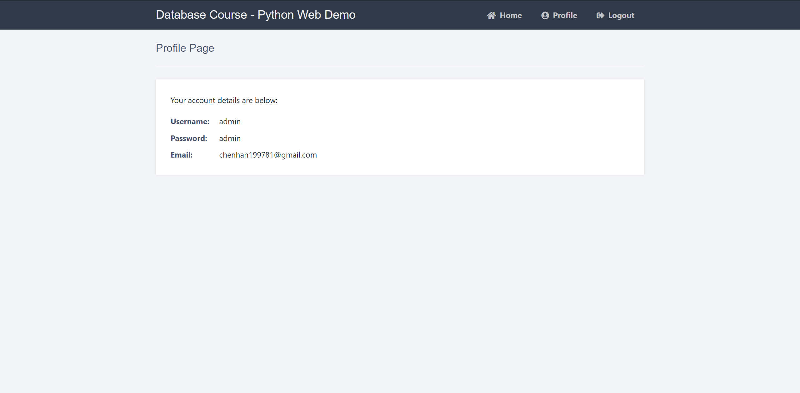

# 第一小组2021年大作业

## 中文(Chinese)
## 功能：
- [x] 增加用户
- [x] 更新用户
- [x] 删除用户
- [x] 注册用户
- [x] 登录用户
- [ ] 列表分页

## 项目介绍
本项目旨在构建一个用户权限管理系统，鉴于flask的高效及简洁，我们选择基于flask搭建我们的系统。
### 项目功能介绍
本系统主要包含以下功能：
- *用户注册* 对于未注册用户，可以通过注册界面注册。同时，对于已经注册用户，不允许重复注册，并且对于用户名称及电子信箱做了正则校验。用户注册成功会弹出提示，并且引导用户完成登录。
- *用户登录* 对于已经注册的用户，我们会从数据库校验用户的用户名及密码是否一致，符合即允许登录，否则禁止登录。同时，我们将用户分为管理员和普通用户两个权限组。如果登录用户属于管理员组，那么用户登录后会自动显示管理员Dashboard界面，否则只显示普通用户界面。
- *用户信息显示* 对于所有用户，我们提供用户个人信息展示界面，可以显示当前用户的用户名、密码、权限等。
- *用户登出* 对于所有用户，我们提供登出操作，可以清除当前浏览器用户的登录信息。
- *权限管理* 对于管理员用户，我们提供用户权限管理界面。在此我们可以进行如下操作：
    - *增加用户* 等于注册新的用户，区别是管理员可以增加用户。
    - *删除用户* 可以手动删除用户。
    - *修改用户信息* 可以对用户名、密码、邮箱、用户权限进行修改。
## 运行步骤
### 一键运行
本项目使用Docker部署，省去了配置复杂环境的步骤，便于在独立平台迁移部署，同时编写了相应的部署脚本，实现一键部署。首先，我们简要描述一下本项目的运行方式：
通过gitpod打开之后，在根目录运行如下命令即可：

```bash
bash run.bash
```
耐心等待镜像的拉取及构建，此后您可以通过gitpod的远程浏览器暴露的5000端口访问应用，默认管理员用户名及密码均为`admin`。


由于数据库初始化设定为数据库容器启动完成后的20秒，因此可能会由于数据库容器尚未启动便执行了初始化命令导致出错，如果遇到登录后报500 错误，您可能需要运行如下命令来初始化数据库。请注意，这不是必须的。
```bash 
docker exec -i mysqldb sh -c 'exec mysql -uroot -p"test"' < ./accounts.sql
```

### 具体运行流程
本项目基于flask构建前后端应用，其中数据库采用Mysql，并且分别创建了对应的docker 容器，具体流程如下：
- 创建数据及配置卷
- 创建自定义网络
- 运行mysql容器并指定网络及配置文件路径
- 初始化数据库及表数据
- 构建flask应用镜像
- 运行flask应用镜像并指定与mysql容器在同一网络下
- 构建成功

当然，本项目也提供了非docker环境下的部署教程，参见后文。
## 功能截图





## English
This repo was updated based on previous open source project and add some new features as below：
- [x] Add new users
- [x] Update user record
- [x] Delete user record
- [ ] Pagination

*Manual for those who want to run local without docker*

### Requirements(Minimum)

Download and install Python, I am using Python 3.7.2, make sure to check the box Add Python to PATH on the installation setup screen. </p>
Download and install MySQL Community Server and MySQL Workbench, you can skip this step if you already have a MySQL server set up. </p>


**Mojor operations handled**

1). Form Design — Design a login and registration form with HTML5 and CSS3.<br>
2). Templates — Create Flask templates with HTML and Python.<br>
3). Basic Validation — Validating form data that is sent to the server (username, password, and email).<br>
4). Session Management — Initialize sessions and store retrieved database results.<br>
5). MySQL Queries — Select and insert records from/in our database table.<br>
6). Routes — Routing will allow us to point our URL's to our functions.<br>

### Requirements ,Packages used and Installation
Download and install Python, for this tutorial I'll be using Python 3.7.2, make sure to check the box Add Python to PATH on the installation setup screen
 
### Installation
          
Navigate to your current project directory for this case it will be **Login-System-with-Python-Flask-and-MySQL**. <br>
          
### 1 .Create an environment
          
Depending on your operating system,make a virtual environment to avoid messing with your machine's primary dependencies
          
**Windows**
          
```

cd Login-System-with-Python-Flask-and-MySQL
py -3 -m venv venv

```
          
**macOS/Linux**
          
```
cd Login-System-with-Python-Flask-and-MySQL
python3 -m venv venv

```

### 2 .Activate the environment
          
**Windows** 

```venv\Scripts\activate```
          
**macOS/Linux**

```. venv/bin/activate```
or
```source venv/bin/activate```

### 3 .Install the requirements

Applies for windows/macOS/Linux

```pip install -r requirements.txt```
  
### 4. Run the application 

**For linux and macOS**
Make the run file executable by running the code

```chmod 777 run```

Then start the application by executing the run file

```./run```

**On windows**
```
set FLASK_APP=main
flask run

```
          

